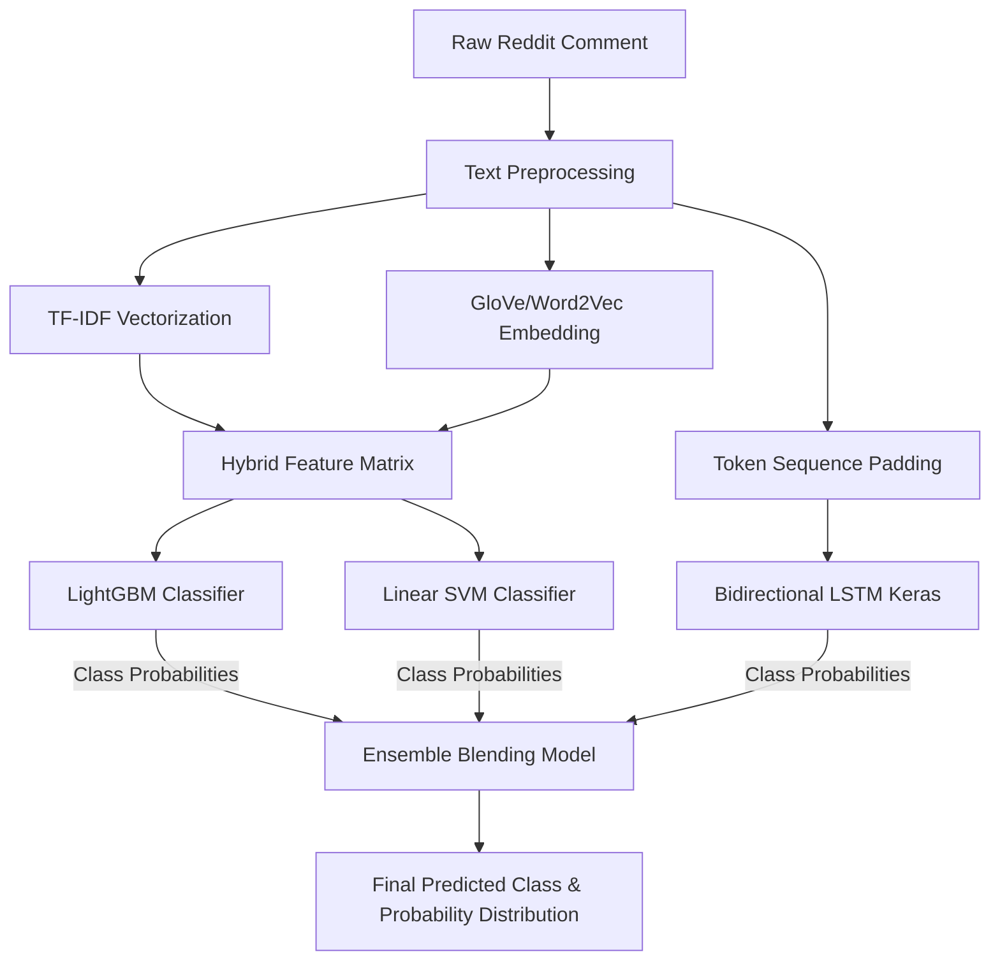

# Tracing Internet Vernacular: Reddit Slang Classifier

[](https://www.python.org/)
[](https://streamlit.io/)
[](https://tensorflow.org/)
[](https://scikit-learn.org/)
[](LICENSE)

An interactive, machine-learning-powered analytics dashboard for identifying, classifying, and studying the evolution of internet slang in Reddit comments from **2014 to 2024**. 

This repository implements a multi-model ensemble system (combining LightGBM, Support Vector Machines, and Bidirectional LSTMs) to categorize comments into five classes of modern vernacular, providing real-time text analysis, token-level interpretability, and detailed sociological insights.

---

## 🗺️ System Architecture

The classifier processes raw text input through a hybrid feature engineering pipeline, feeding both dense sequential representations and sparse statistical representations to an ensemble of models:



### Classification Categories
1. **Abbreviation**: Shorthand communication (e.g., `ngl`, `tbh`, `fr`, `iykyk`).
2. **Meme/Irony**: Culturally coded internet humor, catchphrases, and slang (e.g., `rizz`, `cap`, `cringe`, `delulu`).
3. **Profanity**: Explicit terms and offensive slang (e.g., `fuck`, `shit`, `bastard`).
4. **Sentiment/Expression**: Exclamations, emotional emphasis, and colloquial mood terms (e.g., `sheesh`, `vibe`, `goat`).
5. **Other**: General conversational internet-speak that doesn't cleanly map to the other categories.

---

## 🚀 Key Features

* **Real-Time Slang Classification**: Input any text to get instant category predictions and probability distributions. Compare performance across individual base models (SVM, LightGBM, BiLSTM) and the Meta-Ensemble.
* **Token-Level Attribution**: Inspect word-level contributions to predictions using calibrated linear decision boundary weights, highlighting exactly which terms triggered the classification.
* **Linguistic Evolution Analytics**: Visualize shifting trends in Reddit communication over an 11-year span (2014-2024) across a dataset of **1M+ comments**, revealing historical correlations (e.g., the steady rise of *Abbreviations* vs. the decline of *Profanity*).
* **Interactive Data Explorer**: A built-in dictionary cataloging dozens of slang words, meanings, and historical context.

---

## 📂 Project Directory Structure

```text
fyp-reddit-slang-classification/
│
├── .devcontainer/             # Devcontainer configs for containerized development
├── .gitattributes             # Git LFS tracking configuration for model checkpoints
├── .gitignore                 # Specifying files and folders to ignore (while unignoring models)
├── LICENSE                    # MIT License file
├── README.md                  # Comprehensive documentation (this file)
├── app1.py                    # Core Streamlit application & interactive UI code
├── requirements.txt           # Python dependency declarations
│
└── [Model Artifacts - Managed by Git LFS]
    ├── bilstm_ensemble.keras  # Trained Bidirectional LSTM neural network
    ├── ensemble_model.pkl     # Meta-classifier / blending weights estimator
    ├── idf_dict.pkl           # TF-IDF inverse document frequency dictionary
    ├── lgbm_v2.pkl            # Trained LightGBM model checkpoint
    ├── mlb.pkl                # Label encoder mapping classes to vectors
    ├── svm_v2.pkl             # Trained Support Vector Machine model
    ├── tfidf_vectorizer.pkl   # Fitted Scikit-learn TF-IDF Vectorizer
    ├── tokenizer.pkl          # Keras Tokenizer mapping words to sequence IDs
    └── word2vec_bundled.pkl   # Bundled word embeddings mappings
```

---

## ⚡ Installation & Setup

### Prerequisites
- **Python 3.10+**
- **Git LFS (Large File Storage)**: Model files are tracked using Git LFS. Ensure LFS is installed on your system before cloning, otherwise only pointer files will be pulled.

### Installation Steps

1. **Install Git LFS** (if not already installed):
   ```bash
   git lfs install
   ```

2. **Clone the repository**:
   ```bash
   git clone https://github.com/arilkpanda/fyp-reddit-slang-classification.git
   cd fyp-reddit-slang-classification
   ```

3. **Pull model checkpoints** (ensures all LFS files are downloaded correctly):
   ```bash
   git lfs pull
   ```

4. **Set up a Virtual Environment**:
   ```bash
   # Create environment
   python -m venv venv
   
   # Activate environment (Windows)
   venv\Scripts\activate
   
   # Activate environment (macOS/Linux)
   source venv/bin/activate
   ```

5. **Install Dependencies**:
   ```bash
   pip install -r requirements.txt
   ```

6. **Run the Dashboard**:
   ```bash
   streamlit run app1.py
   ```

---

## 📊 Model Performance & Evaluation

The dashboard integrates evaluation metrics computed over a large validation split. Below is the summary of model performances:

| Model | Sub-Accuracy | Macro F1-Score | Weighted Avg Precision | Weighted Avg Recall |
| :--- | :---: | :---: | :---: | :---: |
| **Ensemble (Meta)** | **90.47%** | **0.91** | **0.94** | **0.93** |
| **LightGBM** | 89.81% | 0.90 | 0.92 | 0.94 |
| **SVM (Linear)** | 89.28% | 0.90 | 0.94 | 0.92 |
| **BiLSTM** | 88.45% | 0.89 | 0.93 | 0.90 |

### Insights on Category Correlations
- **Abbreviation vs. Profanity**: Strong negative correlation. As online spaces mature or moderate, abbreviations and coded shorthand tend to replace overt, crude profanity.
- **Abbreviation vs. Meme/Irony**: Strong positive correlation. Meme culture heavily relies on abbreviation-centric expressions (e.g. `sus`, `cap`, `rizz`).

---

## 🛠️ Built With

* **[Streamlit](https://streamlit.io/)** - For rapid creation of interactive web dashboards.
* **[TensorFlow/Keras](https://www.tensorflow.org/)** - Powering the deep sequential Bidirectional LSTM network.
* **[Scikit-Learn](https://scikit-learn.org/)** - For TF-IDF feature extraction, SVM implementation, and evaluation metrics.
* **[LightGBM](https://lightgbm.readthedocs.io/)** - Gradient boosting framework for fast, high-performance classification.
* **[Gensim](https://radimrehurek.com/gensim/)** - Word representation using Word2Vec and GloVe embeddings.
* **[Altair](https://altair-viz.github.io/)** - Declarative statistical visualization library used for temporal charts and correlation matrices.

---

## 📝 License

This project is licensed under the MIT License - see the [LICENSE](LICENSE) file for details.